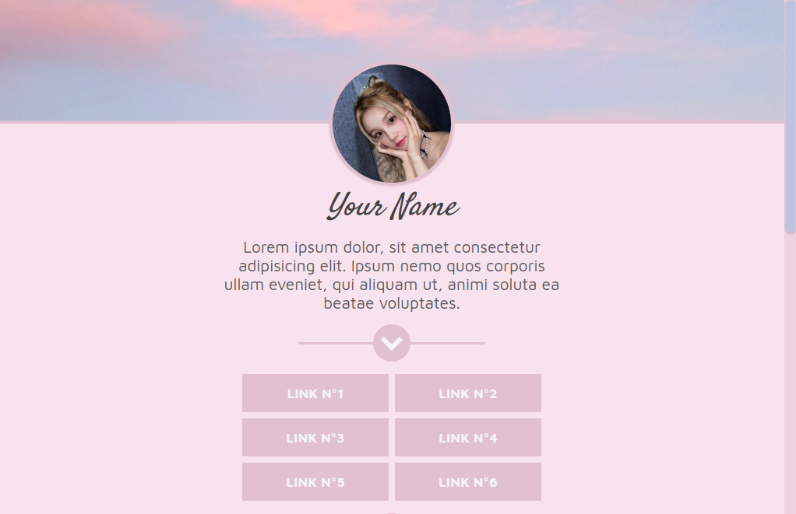

# Landing page para biografía de Redes Sociales

Este es una plantilla de _landing page_ estilo árbol de enlaces personales, puedes clonar el repositorio para usarlo en lo que quieras.

Posee:

- barra de scroll personalizada.
- etiqueta de enlace (data-title) perzonalizada.
- marco de foto de perfil con sombreado animado
- sección de enlaces con texto
- sección de enlaces con iconos
- sección de opiniones con valoración
- sección de contacto

### 쯈ué es _**Árbol de enlaces**_?

- Según 🤓 [SoyBorjaLopez](https://soyborjalopez.es/que-es-pagina-arbol-enlaces/#:~:text=Una%20p%C3%A1gina%20o%20%C3%A1rbol%20de%20enlaces%20es%2C%20como%20su%20nombre,aquellas%20p%C3%A1ginas%20que%20te%20interesan.): Una página o _**Árbol de enlaces**_ es, como su nombre indica, una página con enlaces que dirigen a otras páginas. Disponer de una página de enlaces resulta bastante útil para dirigir tráfico hacia aquellas páginas que te interesan.

<!--  -->

## Tecnologías usadas

<!-- 
 -->

> **Aclaraciones:** (FAQs)
>
> No ha sido probado para tener soporte crossbrowsing
>
> Ha sido programado con fines académicos

<!-- 

 -->

---

## 📄 Licencia

MIT Public License v3.0

No puede usarse comercialmente
